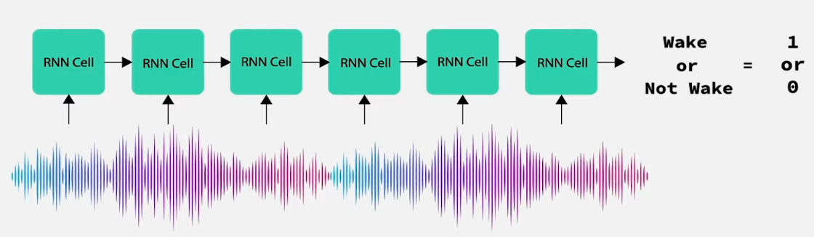

# Word Detection

## Architecture

- Word Listener: to listen and feed the sound to Word Detection Model
- Word Detection Model: Binary classification (e.g "Hey Siri" or not "Hey Siri" words)

## Word Detection Model

- Binary Classification - Recurrent Network
- Data:
  - Class 0 (Non-wakeword): ambient noise (keyboard clicking, dog barking, other words)
  - Class 1 (Wakeword):

<p align="center"></p>

### Data Collection & Preparation

#### Collection

- Class 0:

  - Noise background (infinite record until press Ctrl+C): `python src/word_detection/utils/data_collection/word_audio.py --sample_rate 8000 --save_path ./data/word_detection/noise.wav`
    - Split the noise background into chunks: `python src/word_detection/utils/data_collection/split_audio_into_chunks.py --seconds 2 --audio_file_name data/word_detection/noise.wav --save_path data/word_detection/0`
  - Common Voice:
    - Download [Common Voice](https://commonvoice.mozilla.org/en/datasets) dataset & unzip. Store the **clips** folder and the `other.tsv` in the data/word_detection folder
    - Run this script to split common voice into chunks: `python src/word_detection/utils/data_collection/split_commonvoice.py --seconds 2 --data_path data/word_detection/clips --file_name other.tsv --save_path data/word_detection/0`

- Class 1 (2 seconds): `python src/word_detection/utils/data_collection/word_audio.py --sample_rate 8000 --seconds 2 --interactive --interactive_save_path ./data/word_detection/wakewords`
  - To avoid the imbalanced dataset problem, we can duplicate the wakeword clips:
    `python src/word_detection/utils/data_collection/replicate_audios.py --wakewords_dir data/word_detection/wakewords/ --copy_destination data/word_detection/1/ --copy_number 100`

#### Preparation

- Create `train.json` & `test.json` by
  - `python src/word_detection/utils/data_collection/create_wakeword_jsons.py --zero_label_dir data/word_detection/0 --one_label_dir data/word_detection/1 --save_json_path data/word_detection`

```json
{"key": "data/word_detection/0/2_common_voice_en_38032387.wav", "label": 0}
{"key": "data/word_detection/0/3_common_voice_en_38032478.wav", "label": 0}
{"key": "data/word_detection/0/0_common_voice_en_38047363.wav", "label": 0}
{"key": "data/word_detection/0/0_common_voice_en_38031528.wav", "label": 0}
{"key": "data/word_detection/1/1_7.wav", "label": 1}
```
